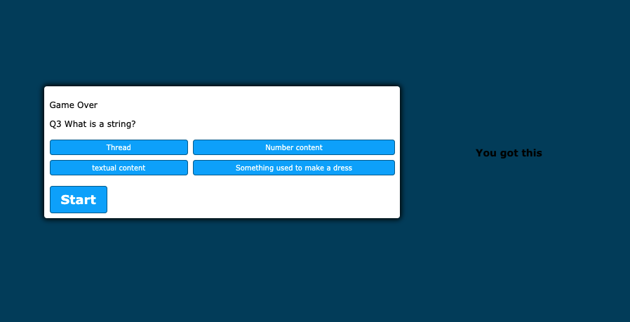

# 04-homework
Lori Timmons 
04 Web APIs: Code Quiz
Description:
This quiz will get you prepared to enter the JavaScript world. When you click the start button a timer will start. You will have 60 seconds to complete this quiz. If you give a wrong answer time will deduct fro, your time. Don't forget to check your score. Good luck!

<!-- ScreenShot -->

URL of the deployed application: https://loritimmons.github.io/04-homework/

The URL of the GitHub repository: https://github.com/LoriTimmons/04-homework/settings/pages

Dev note: I did use a online help to make this code. I do understand the code. My reference was 
https://www.youtube.com/watch?v=riDzcEQbX6k